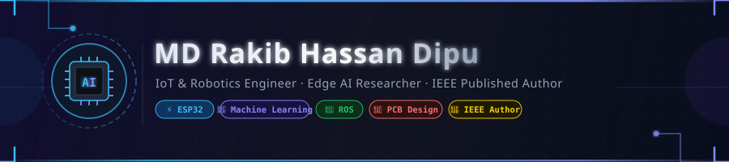

  <!-- Custom Native Futuristic Header Banner -->
  

  <!-- Animated Typing Subtitle -->
  

    
  

  <!-- Quick Action Badges -->
  

    
    &nbsp;
    
    &nbsp;
    
    &nbsp;
    
  

  

    
    
    
  

---

### 👨‍💻 About Me

Passionate engineering student specializing in **IoT, Robotics, Edge AI, and Embedded Systems**. I bridge the gap between low-level hardware design and high-level artificial intelligence—creating end-to-end intelligent systems, digital twins, and autonomous solutions.

- 🔭 **Currently Building**: Edge AI systems, Structural Health Monitoring Digital Twins, and WiFi CSI Localization.
- 🔬 **Research Focus**: IoT-driven healthcare solutions, wearable panic detection, and embedded machine learning.
- 📜 **Publication**: First-author IEEE paper on IoT-based panic attack detection for Autism Spectrum Disorder (*RAAICON 2025*).
- 🏆 **Leadership & Extracurriculars**: Deputy Organizing Secretary at **UFTB Robotics Club** & 1st Runner-Up at **Hult Prize Campus Competition 2025**.
- 💬 **Ask Me About**: `ESP32 / Microcontrollers`, `ROS / Robotics`, `Machine Learning & NLP`, `PCB Layout Design (EasyEDA / Altium)`, and `IoT Cloud Architectures`.
- 📬 **Get in Touch**: Reach me directly via [Email](mailto:rakibdipu007@gmail.com) or [LinkedIn](https://linkedin.com/in/rakibhassandipu).

---

### 🛠️ Technical Arsenal

#### 💻 Programming & Core Languages

  
  
  
  
  
  

#### 🧠 Artificial Intelligence & Machine Learning

  
  
  
  
  
  
  

#### ⚡ IoT, Robotics & Embedded Hardware

  
  
  
  
  
  
  

#### 🛠️ Developer Tools, Cloud & Databases

  
  
  
  
  
  
  

---

### 🌟 Featured Research & Projects

| Project | Description | Tech Stack | Link |
| :--- | :--- | :--- | :---: |
| 🌉 **Bridge SHM & Digital Twin** | Low-Cost IoT-Enabled Bridge Structural Health Monitoring using ESP32-S3, MPU9250 MEMS sensor, 1024-point FFT edge analysis & Digital Twin visualization. | `ESP32-S3` `MPU9250` `FFT` `Digital Twin` | [Repo 🔗](https://github.com/rakibdipu/Bridge-SHM-DigitalTwin-Structural-Health-Monitoring-) |
| 📶 **WiFi CSI Indoor Localization** | Device-free indoor localization and human presence detection system leveraging WiFi Channel State Information (CSI) & ML. | `ESP32` `WiFi CSI` `Machine Learning` `Python` | [Repo 🔗](https://github.com/rakibdipu/WiFi-CSI-Indoor-Localization-System) |
| 🎓 **Opportunity Pro (AI Suite)** | Global portal for upcoming Internships, RA positions & funded Graduate Scholarships with built-in 3-in-1 Gemini AI suite. | `Python` `Gemini AI` `Automation` `Streamlit/Flask` | [Repo 🔗](https://github.com/rakibdipu/Opportunity-Pro) |
| 📹 **AI YouTube Video Summarizer** | End-to-end processing pipeline downloading videos, transcribing speech, and generating structured summaries via LLMs. | `Python` `NLP` `Whisper/LLMs` `PyTorch` | [Repo 🔗](https://github.com/rakibdipu/YouTube-video-Summarizer-) |
| 🚨 **Autism Panic Attack Detection** | Lightweight IoT-driven wearable panic detection system with instant caregiver alerts and behavioral pattern tracking. | `IoT` `ESP32-CAM` `Sensors` `ML` | [Paper 🔗](#-publications--research) |
| 💬 **AI Buyer Help Chatbot** | Intelligent e-commerce conversational assistant with intent recognition and automated order assistance. | `Python` `NLP` `Flask` `HTML/JS` | [Repo 🔗](https://github.com/rakibdipu/BuyerHelpChatbot) |

---

### 📚 Publications & Research

> **📄 Lightweight IoT-Driven Panic Attack Detection and Caregiver Alert System for Autism Spectrum Disorder**  
> **Authors:** **MD Rakib Hassan Dipu** (First Author)  
> **Conference:** *2025 IEEE 4th International Conference on Robotics, Automation, Artificial Intelligence, and Internet-of-Things (RAAICON)*  
> **Location:** Military Institute of Science and Technology (MIST), Dhaka, Bangladesh  
> **ISBN / Catalog:** `979-8-3315-9281-3/25` · ©2025 IEEE  
> **Keywords:** `IoT` `Autism Spectrum Disorder (ASD)` `Panic Attack Detection` `Embedded Sensors` `Machine Learning`

---

### 🏆 Honors & Achievements

- 🥇 **First-Author IEEE Conference Paper** – Accepted & Presented at IEEE RAAICON 2025.
- 🥈 **1st Runner-Up** – Hult Prize Campus Competition 2025.
- 🎖️ **Deputy Organizing Secretary** – UFTB Robotics Club.
- 📜 **21st Century Employability Skilling Certification** – Intermediate Level (Wadhwani Foundation).

---

### 📊 GitHub Activity & Analytics

  

    
    
  

  

    
  

---

### 🤝 Let's Connect & Collaborate!

  
  &nbsp;
  
  &nbsp;
  
  &nbsp;
  

  <i>⚡ "Engineering intelligent hardware and AI solutions to solve real-world challenges." ⚡</i>

<!-- Native Footer Line -->

  

